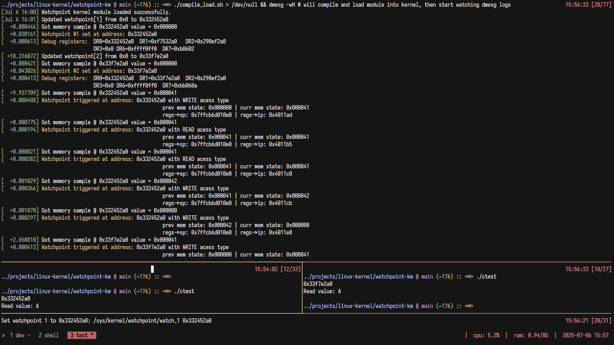

# Watchpoint Kernel Module

<a href="#"></a>
<a href="#"></a>
<a href="#"></a>

## Description

#### This Linux kernel module sets a hardware breakpoint on a specified memory address.
#### When the memory address is accessed (either read or write), the module's callbacks are called, and information about access provided.
#### On architectures that support R,W,X,RW type of hardware breakpoints it will set 2 breakpoints (1 for READ and 1 for WRITE).
#### On architectures that do not support exclusive read (R) hardware breakpoint it will set R|W and infer access type by probing the memory before and after accesses.

## Features

- Monitor a memory address set via module parameter or sysfs entry.
- Set a hardware breakpoint on the specified memory address.
- Invoke callbacks and print details about memory access.
- Planned: dump stack of a process which accessed the memory.

## Requirements

- Linux kernel version 4.x or higher.
- Linux kernel that supports kernel modules insertion (NOT standard WSL/WSL2 kernel)

## Installation
**Clone the repo:**
```sh
git clone https://github.com/webmessia-h/watchpoint-km.git
```

### Building with Yocto
**Add the recipe to your layer:**

- Copy the `watchpoint.bb` file and the module source files (`src/watchpoint.c`, `Makefile`, `COPYING`) to your layer (e.g., under `recipes-kernel/watchpoint/`).

Example structure:
```fs
meta-mycustom/
└── recipes-kernel/
    └── watchpoint/
        ├── watchpoint.bb
        ├── Makefile
        ├── COPYING
        └── src/
            └── watchpoint.c
```

Example how to achieve:
```sh
mkdir recipes-kernel/watchpoint
cp -r $repo/src recipes-kernel/watchpoint/src
cp $repo/Makefle recipes-kernel/watchpoint/Makefile
cp $repo/yocto/* recipes-kernel/watchpoint/
```

> [!IMPORTANT]
>
> Ensure the checksums in LIC_FILES_CHKSUM match those of your COPYING file.

**Build the kernel module using bitbake:**
```sh
bitbake watchpoint
```

## Usage
### Loading the Module
**Copy the built module to the target device:**
```sh
scp watchpoint.ko root@target_device:/lib/modules/$(uname -r)/extra/
```

**Load the module:**
```sh
modprobe watchpoint [watch_address=<0xYourMemoryAddress>]
```

**Verify the module is loaded:**
```sh
lsmod | grep watchpoint
```

**Or use `./compile_load.sh [target_dir]` for local testing, it will compile, (re)load the module and notify you**

> [!TIP]
> To unload the module, use `rmmod watchpoint`.

### Setting watchpoint 
**To set a watchpoint address as parameter, use:**
```sh
insmod watchpoint.ko watch_address=0x1234
```

**Or you can set the watchpoint address through the **sysfs** interface**:
```sh
echo '0x1234' | sudo tee /sys/kernel/watchpoint/watch_address
```

> [!IMPORTANT]
> There is check mechanism that will make sure your address is well-aligned

## Testing:
**There is `src/test.c` file which allocates memory on heap and prints the address, you should:**
```sh
 gcc -o test src/test.c
 ./test # it will print the allocated memory address, wait on getchar() and start modifying the memory at given address
```
Then you can
```sh
./set_watchpoint.sh <address>
```

To see logs, use: `sudo dmesg`, I prefer to first run it with `-C` flag to clear the logs,
and then with `-wH` flag so it follows.

### Below is a test case on x86_64 machine (WSL2):



## WSL/WSL2 kernel workarounds to insert module
**Install build-essential flex bison libssl-dev libelf-dev git dwarves**
```sh
git clone https://github.com/microsoft/WSL2-Linux-Kernel.git
cd WSL2-Linux-Kernel
cp Microsoft/config-wsl .config # here the config already includes options required to insert modules
make -j$(nproc)
# wait
cp arch/x86/boot/bzImage /mnt/c/Users/<YOUR_USER>/bzImage
```

Create the file C:\Users\<YOUR_USER>\.wslconfig that contains:
```
 [wsl2]
 kernel=C:\\Users\\<YOUR_USER>\\bzimage # double \ are required, dont leave any trailing spaces
```

```pwsh
wsl --shutdown
```
 Voilà! Your WSL now has custom kernel and you can insert modules and build them against that kernel.


## License

## This project is licensed under the GPL License. See the COPYING or LICENSE file for details.
